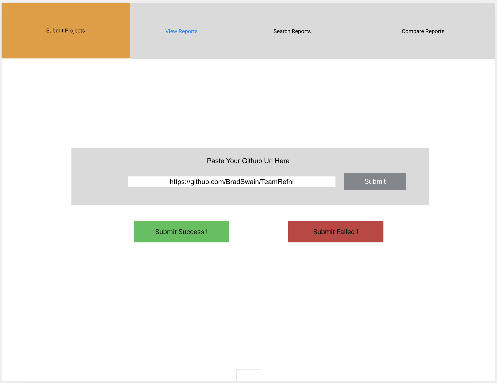
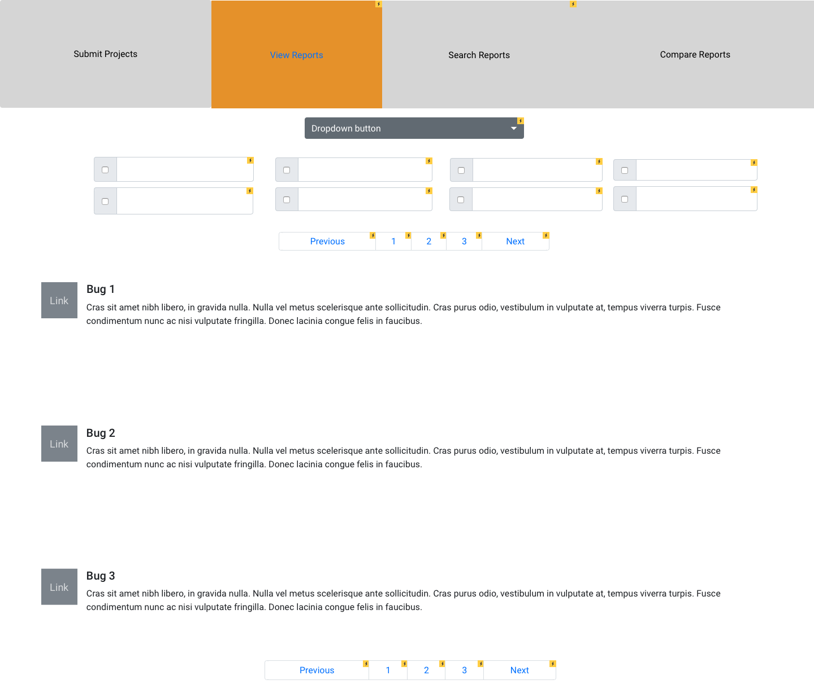
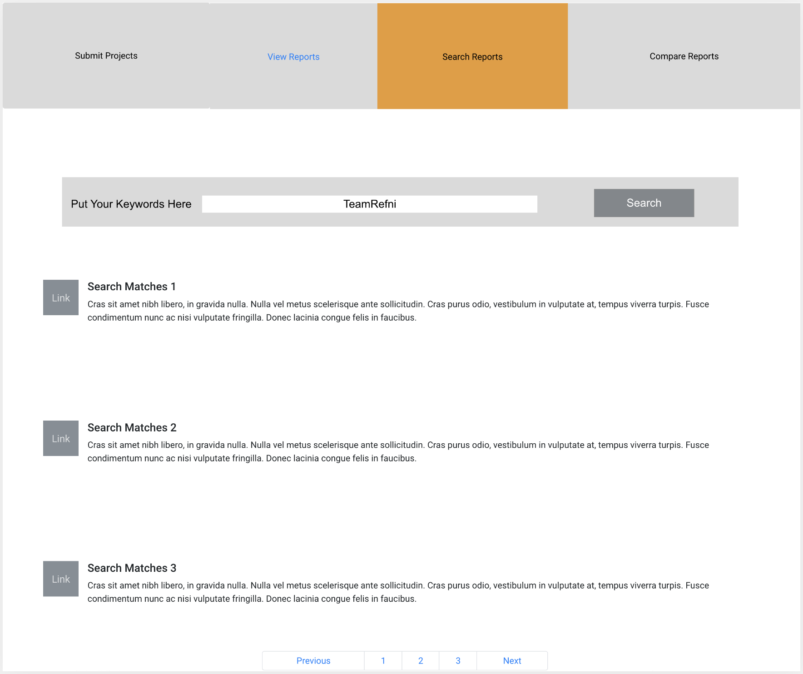
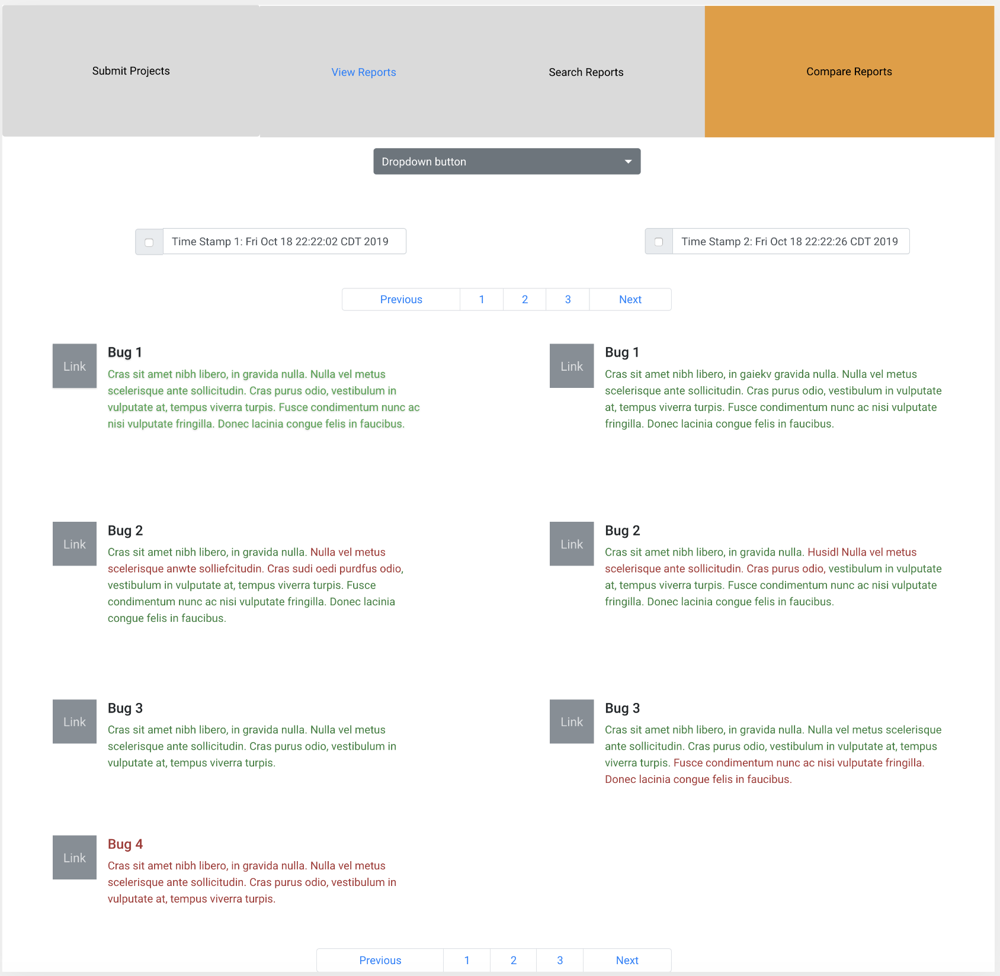

# 606 Project Iteration 0: ClouDroid

Team Name: Refni

- Scrum Master: Yahui Sun
- Product Owner: Brad Swain
- Other Team Members: Luochao Wang, Yifan Liu, Tianlong Chen, Junru Wu
- Client Name: Jeff Huang

## Important Links

- Github: https://github.com/BradSwain/TeamRefni/
- Pivotal: https://www.pivotaltracker.com/n/projects/2406547
- Vimeo: https://vimeo.com/367350607 (Password: TeamRefni)

## Summary

ClouDroid turns existing android static analysis tools into __a web based service to scan for and track potential bugs/vulnerabilities across releases or individual changes in Android applications.__
Users should be able to:

1. Supply a link to source code on github or a similar service and receive a report about potential bugs and vulnerabilities found.
2. Specify particular versions or commits to be analyzed and compare reports to see what bugs were fixed/introduced.
3. Analyze many projects at once without the service slowing down.
    - The analysis tools being run are computationally expensive and can take a long time to run. The service must accommodate many users requesting code to be scanned simultaneously without slowing down significantly.


## Stories

```
As an anonymous user
When I visit the homepage
I want to be able to submit a project to be analyzed
So that the report will be available for viewing
```
```
As an anonymous user
When I visit the homepage
I want to be able to search for a project report by project name
So that I can find reports that are available for viewing for that project
```
```
As an anonymous user
When I click a project report
I want to see the bug report for that project
So that I can see what bugs were found
```
```
As an anonymous user
When I search for reports
I want to be able to compare multiple reports
So that I can see how the big reports differ overtime or between projects
```

---

## User Interface

Mockup 1: Users can __submit an Android app for analysis__.



Mockup 2: Users can __view vulnerability reports__ for the submitted Android app.



Mockup 3: Users can __search bug reports based on keywords__.



Mockup 4: Users can __compare two vulnerability reports__.



## Customer Meetings

- Place: HRBB 416
- Dates: Prior to each Iteration
- Times: Must work around client's busy schedule
 
## Grading Approach:

This project is unique in that there is an emphasis on the underlying infrastructure. Our customer has requested the system be scalable and so a large amount of effort is being put into the design of the cloud infrastructure.